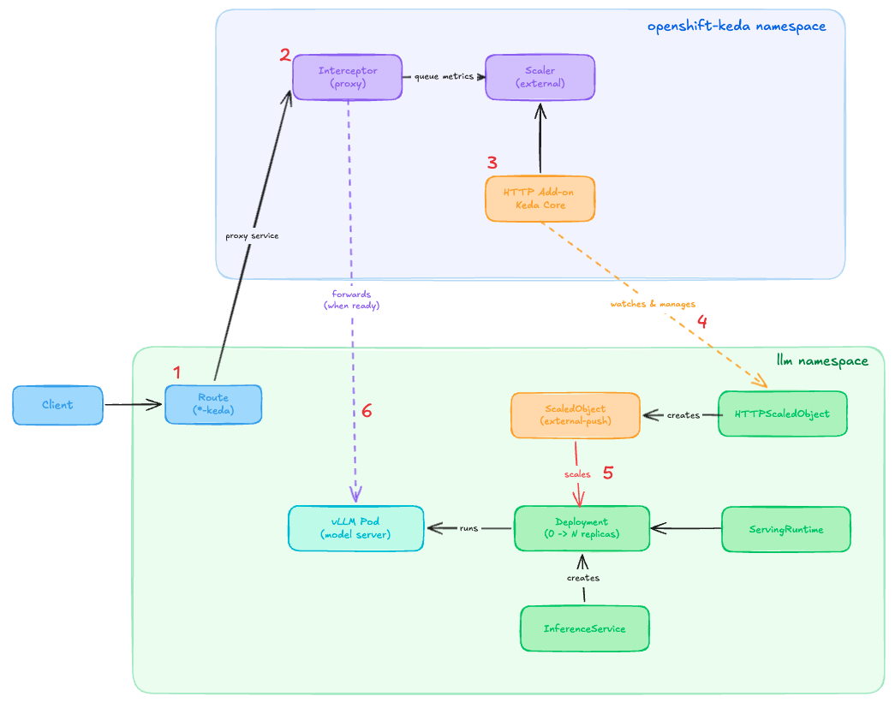

# MaaSical Chairs

> *When the music stops, your GPUs don't have to keep running.*

Elastic, cost-efficient GPU model serving with rapid scale-to-zero and on-demand scaling for LLM inference on OpenShift AI.

## The Problem: GPU Costs Never Sleep

Running LLMs on GPUs is expensive. Traditional deployments keep at least one replica running 24/7, even when no one's asking questions at 3 AM. That's like leaving all the lights on in an empty office.

**The math is brutal:**
- 1 GPU idle for 20 hours/day × 30 days = 600 GPU-hours wasted
- At ~$2/hour, that's $1,200/month per model doing nothing

## The Solution: Musical Chairs for Models

MaaSical Chairs implements **true scale-to-zero** for LLM inference:

```
Idle model → 0 replicas → 0 GPUs → $0 cost
Request arrives → Scale 0→1 → Serve → Scale back to 0
```

> **Note:** This project currently supports **vLLM** serving runtime. Support for **llm-d** (distributed LLM serving) is under development.

**Density Goal:** Serve up to 80 models on 4-15 dynamically scaled GPU nodes.

## Architecture at a Glance



**How it works:**

1. Request arrives → Interceptor catches it (~1ms)
2. Queue the request → Hold while scaling (~0-5s)
3. KEDA scales 0→1 → GPU pod starts (~5-15s)
4. Model loads → vLLM ready (~60-90s cold start)
5. Forward request → User gets response (~1-3s)
6. Idle timeout → Scale back to zero (180s default)

<!-- ```
┌─────────────────────────────────────────────────────────────────────┐
│                         MaaSical Chairs                             │
├─────────────────────────────────────────────────────────────────────┤
│                                                                     │
│   Request ──▶ Route ──▶ KEDA HTTP Interceptor ──▶ Queue            │
│                              │                       │              │
│                              │    (pods = 0?)        │              │
│                              ▼                       ▼              │
│                         HTTPScaledObject ──▶ Scale 0→1             │
│                              │                       │              │
│                              ▼                       ▼              │
│                         vLLM Pod Ready ◀── GPU Allocated           │
│                              │                                      │
│                              ▼                                      │
│                    Interceptor Forwards Request ──▶ Response       │
│                                                                     │
└─────────────────────────────────────────────────────────────────────┘
``` -->

**Key Components:**
| Component | Role |
|-----------|------|
| KEDA Operator | Event-driven autoscaling |
| HTTP Add-on | Intercepts requests, enables 0→1 scaling |
| vLLM | High-performance LLM inference |
| KServe | Model serving framework |

## Why Standard KEDA Can't Scale to Zero

Prometheus-based KEDA works great for 1→N scaling, but hits a chicken-and-egg problem at zero:

| Issue | What Happens | Result |
|-------|--------------|--------|
| No Metrics | No vLLM pod = no Prometheus metrics | KEDA sees no load |
| No Endpoints | Service has no backends | Requests get 503 |
| No Scale-up | KEDA needs metrics to trigger scaling | Stuck at zero |

```
Request → Route → Service (no endpoints) → 503 Error ❌
```

## The HTTP Add-on Fix

The [KEDA HTTP Add-on](https://kedacore.github.io/http-add-on/scope.html) breaks the cycle with an always-on interceptor:

```
Request → Route → Interceptor → Queue → KEDA 0→1 → Forward ✓
```

## Quick Start

See the **[Full Demo Guide](./assets/docs/demo-http-addon.md)** for step-by-step instructions.

**TL;DR:**
```bash
# 1. Install KEDA + HTTP Add-on (one-time setup)
helm install keda-operator helm/keda-operator/ -n openshift-keda
helm install uwm helm/uwm/ -n openshift-monitoring
helm install keda helm/keda/ -n openshift-keda
helm install http-add-on kedacore/keda-add-ons-http -n openshift-keda

# 2. Deploy all models with scale-to-zero
./scripts/deploy-models.sh

# 3. Test scale-up from zero (cold start ~60-120s)
TIMEOUT=300 ./scripts/test-models.sh 2>&1
```

**Expected output:**
```
[llama3-2-3b]    ⏳ No pods - scaling from zero...
[granite3-3-8b]  ⏳ No pods - scaling from zero...
[qwen3-4b]       ⏳ No pods - scaling from zero...
[granite4-micro] ⏳ No pods - scaling from zero...
[granite3-3-8b]  ✓ Response in 65s
[qwen3-4b]       ✓ Response in 72s
[llama3-2-3b]    ✓ Response in 85s
[granite4-micro] ✓ Response in 90s
```

## Available Models

| Chart | Model | GPU Memory | Cold Start |
|-------|-------|------------|------------|
| `helm/llama3.2-3b/` | Llama 3.2 3B | ~8GB | ~60-90s |
| `helm/granite3.3-8b/` | Granite 3.3 8B | ~16GB | ~80-120s |
| `helm/qwen3-4b/` | Qwen3 4B | ~10GB | ~70-100s |
| `helm/granite4-micro/` | Granite 4.0 H-Micro | ~8GB | ~60-90s |

## Configuration

| Parameter | Default | Description |
|-----------|---------|-------------|
| `keda.enabled` | `false` | Enable KEDA autoscaling |
| `httpAddon.enabled` | `false` | Enable scale-to-zero |
| `httpAddon.host` | `""` | Route hostname (required) |
| `httpAddon.minReplicas` | `0` | Min replicas (0 = scale-to-zero) |
| `httpAddon.maxReplicas` | `1` | Max replicas |
| `httpAddon.scaledownPeriod` | `300` | Seconds idle before scaling down |

## Scaling Comparison

| Mode | Range | Idle Cost | First Request |
|------|-------|-----------|---------------|
| No autoscaling | Fixed | Full GPU cost | Instant |
| Prometheus KEDA | 1→N | 1 GPU minimum | Instant |
| **HTTP Add-on** | **0→N** | **$0** | ~60-90s cold start |

## GPU Node Autoscaling

MaaSical Chairs supports **cluster-level GPU node autoscaling** - automatically provisioning new GPU nodes when demand exceeds capacity:

```
4 models need GPUs → Only 3 nodes available → Cluster Autoscaler → New node provisioned
```

**Quick Setup:**
```bash
# Get cluster infrastructure ID
INFRA_ID=$(oc get infrastructure cluster -o jsonpath='{.status.infrastructureName}')

# Install cluster autoscaler
helm install cluster-autoscaler helm/cluster-autoscaler/ \
  --set cluster.infraId=$INFRA_ID \
  --set machineAutoscaler.minReplicas=0 \
  --set machineAutoscaler.maxReplicas=5
```

**Key Features:**
- Scale GPU nodes from 0 to N based on pending pods
- Automatic scale-down of idle nodes after 5 minutes
- Per-AZ MachineAutoscalers for high availability

See **[Cluster Autoscaling Guide](./assets/docs/cluster-autoscaling.md)** for detailed configuration.

## Cleanup

```bash
helm uninstall llama3-2-3b granite3-3-8b qwen3-4b granite4-micro -n $NAMESPACE
oc delete project $NAMESPACE
```

## Troubleshooting

See [Troubleshooting Guide](./assets/docs/troubleshooting.md) for common issues.


